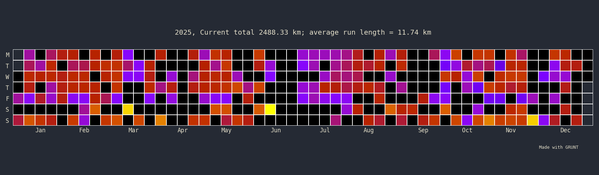
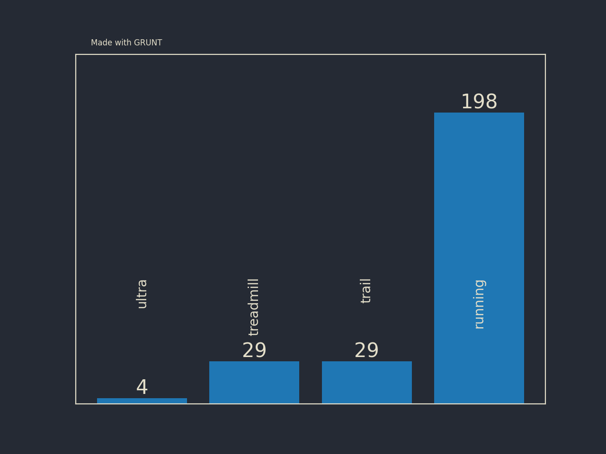
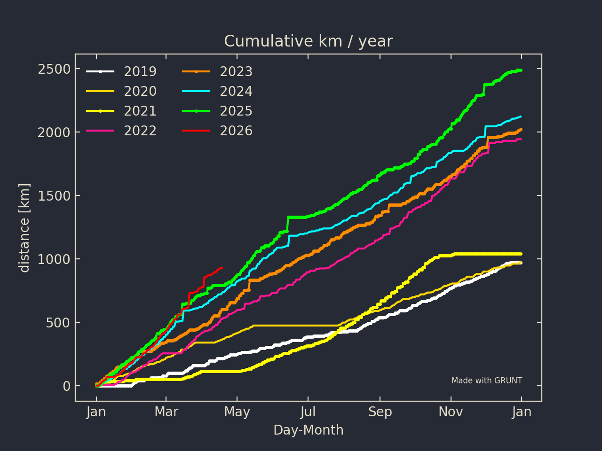
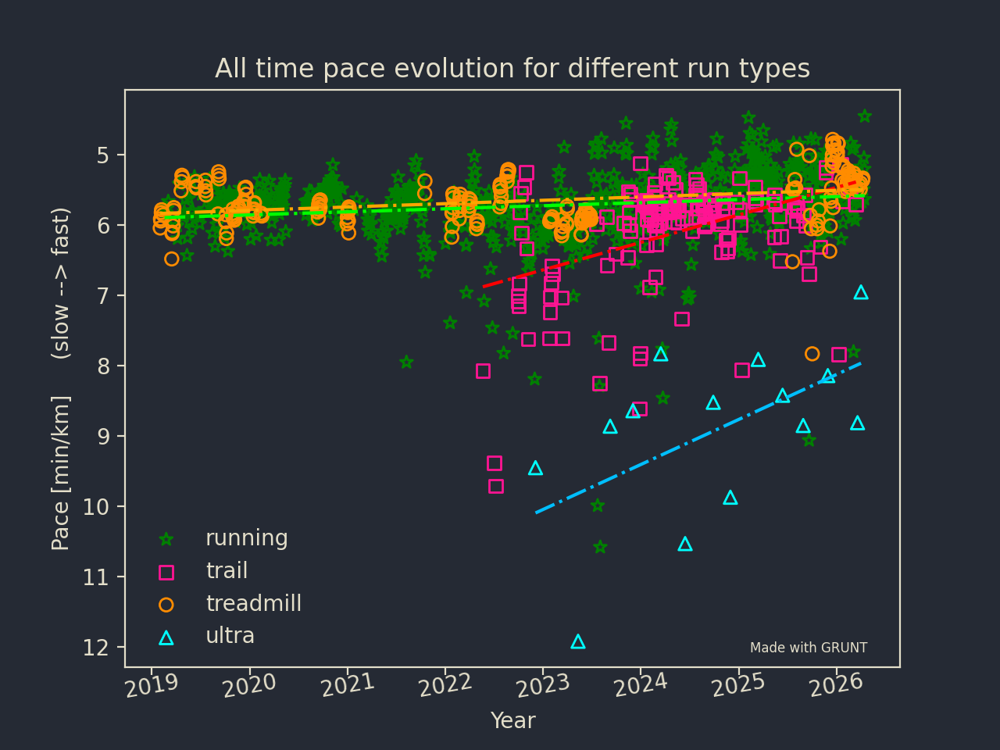
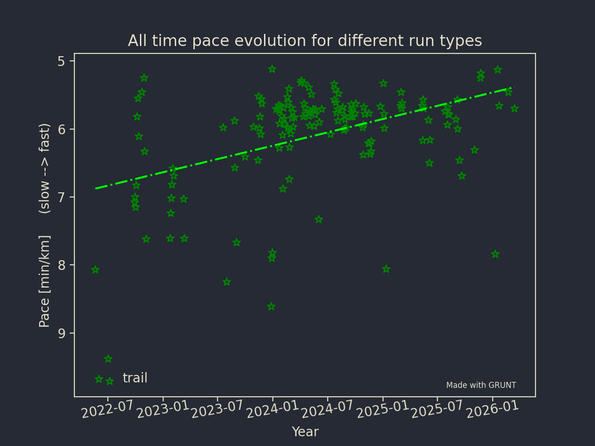
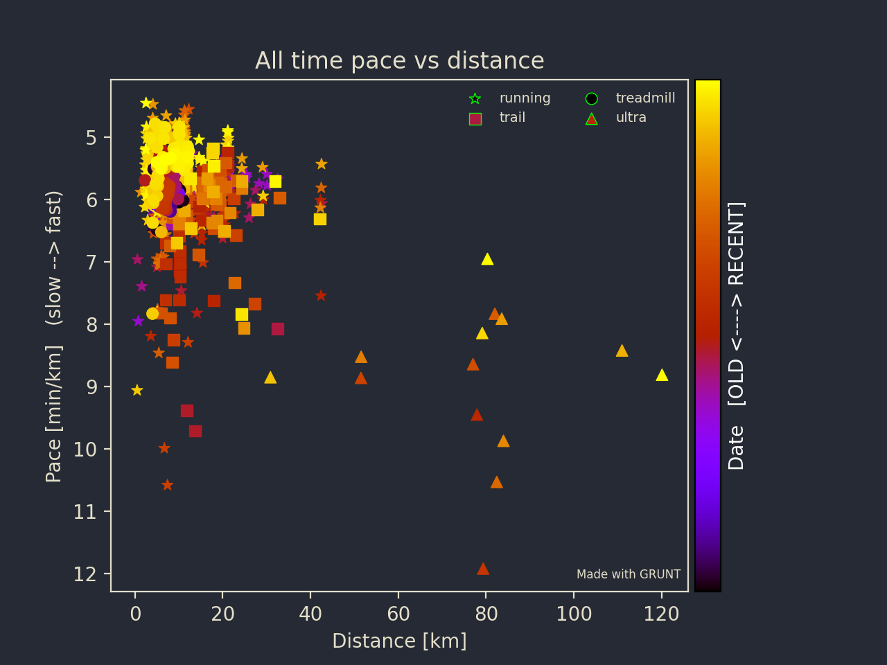

Grunt data visualisation
========================

This is where I explain what plots GRUNT can make and how you can customize them. We are assuming that you already downloaded the data. If you did not, please look at :doc:`download`.

General configuation
--------------------

In the configuration file, three options are available and will be used throughout the rest::

    [Plot_general]
    dpi = 200
    text = 228,223,202
    background = 37,42,52

``dpi`` controls the resolution, ``text`` control the text color (given in RGB values), ``background`` gives the general background of the plot (in RGB values as well).

In addition, each of the other section you will allow you to adjust the following::

    ##Would appreciate if that stays, so GRUNT gets more visibility
    credit = true
    credit_x = 0.90
    credit_y = 0.15

This displays the **"Made with GRUNT"** text on the plot. I'd appreciate you leave it. But of course you don't have to. You can change ``credit = true`` to ``credit = false`` to remove. The two other parameters are adjusting the position of the text. 

Running density calendar
------------------------
This plot is the equivalent of the GitHub commit density calendar adapted for running. To create it you need to enter the following command::

    user@machine % grunt --yearcal 2026 --conf conf_default.txt

In the configuration file, the customization available are::

    [Plot_calendar]
    colormap = gnuplot

    ##Would appreciate if that stays, so GRUNT gets more visibility
    credit = true
    credit_x = 0.90
    credit_y = 0.15

The only major control you have for the that plot is the colormap scheme. You can use whatever is available in matplotlib. The resulting calendar is shown below: 

   Running density Calendar

Run type histogram
------------------

The second plot that you can do is the run type histogram. It shows you the number of each type of run you do in a given year. The command to create it::

    user@machine % grunt --runtype 2025 --conf conf_default.txt

The customisation in the configuration file is::

    [Runtype_plot]
    rt_pad = -100

    ##Would appreciate if that stays, so GRUNT gets more visibility
    credit = true
    credit_x = 0.15
    credit_y = 0.90

``rt_pad`` adjust the position of the vertical text on each bar of the histogram. The final results shows is visible in the next figure.  

   Run type histogram

Cumulative running Distance
---------------------------

The cumulative running distance plots overlaps on the same plot a curve for each year available on the data. Each curves represent the cumulative distance over the year. To create it, enter the following command:

.. code-block::

    user@machine % grunt --conf conf_default.txt --compare_distance

The available customisation parameters are ::

    [Compare_distance_plot]
    ####Compare distance plot
    compare_colors = white,gold,yellow,deeppink,darkorange,cyan,lime,red
    compare_signs = .,.,.,.,.,.,.,.,-.

    ##Would appreciate if that stays, so GRUNT gets more visibility
    credit = true
    credit_x = 0.75
    credit_y = 0.15 

Two main parameters:

* ``compare_colors``: The color of each curve. You should have one color per year. 
* ``compare_signs``: the linestyle of each curve. 

The resulting figure is visible below.

   Cumulative running distance

Pace evolution over time
------------------------

The next plot that you can do is the all-time evolution of the pace with time for a given running type. The command is::

    user@machine % grunt --conf conf_default.txt --pace OPTION 

``OPTION`` can take the following options: ``running``, ``ultra_run``, ``treadmill_running``, ``trail_running``, ``all``. For each type, GRUNT will make a linear fit of the data. 

Customisable parameters are::

    [Pace_plot]
    colors = green,deeppink,darkorange,cyan
    signs = *,s,o,^
    fit_colors = lime,red,orange,deepskyblue

    ##Would appreciate if that stays, so GRUNT gets more visibility
    credit = true
    credit_x = 0.75
    credit_y = 0.13

``colors`` lets you choose the color of the plot. If you asked for ``all``, you need to give 4 colors. As this is a scatter plot, you will also need to give the marker ``signs``. One for each run type as well. Finally, you need to choose the color of the fit (``fit_colors``). Again, one for each run type.  

This gives you the following figure:

   All time Evolution of the pace per running type ('all' option)

   All time Evolution of the pace per running type ('trail_running' option)

All time Pace vs Distance
-------------------------

The pace vs distance is the next one you can have a look at. The command to run it is::

    user@machine % grunt --pvd --conf conf_default.txt 

Again, the available customization are::

    [Pacedistance_plot]
    signs = *,s,o,^
    colormap = gnuplot

    ##Would appreciate if that stays, so GRUNT gets more visibility
    credit = true
    credit_x = 0.65
    credit_y = 0.13

``signs`` gives the sign to attribute to each runtype while ``colormap`` colors the markers based on the date. 

   All time, all type, pace VS distance

